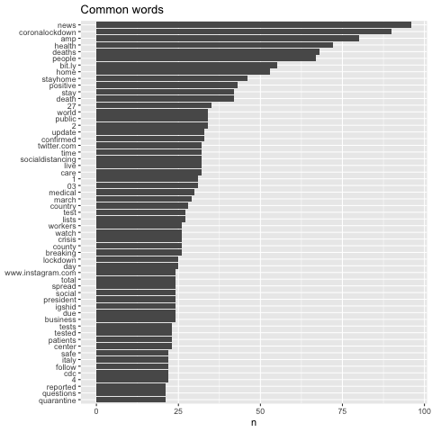
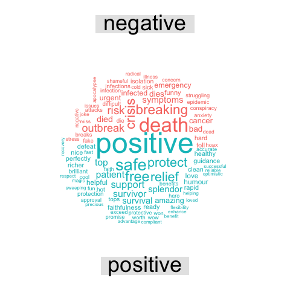

# COVID-19 Sentiment Analysis

Using Twitter data to perform sentiment analysis on the tweets on the COVID-19 virus.

## Background

The recent Cornovirus COVID-19 has created a global emergency demanding social distancing, working from home, and self quarantining to control the spread of the virus. As a result, in my spare time I decided to explore how people are reacting and talking about the pandemic online.

## Data

For this project, 10000 tweets with the "COVID-19" related keywords between March 20 to March 28 in 2020 were fetched for analysis.

### Keywords

Generic
```
#COVID19
#covid19
#coronavirus
#CoronaVirus
```

More Specific
```
#coronavirustexas
#Coronavirustexas
#coronavirusnewyork
#coronaviruscalifornia
```

### I. Non-API Method of data collection using Python3

Twitter API has limits which vary over time and currently allows one week's data. Some packages allow to collect historical Twitter data. 

Package used here: [GetOldTweets3](https://pypi.org/project/GetOldTweets3/) 
* [Jefferson Henrique](https://github.com/Jefferson-Henrique/GetOldTweets-python)
* [Dimtry Mottl](https://github.com/Mottl/GetOldTweets3) 

This non-API method scrapes Twitter data based on Twitter search results by parsing the result page with a scroll loader, then calling to a JSON provider. While theoretically it can search through oldest tweets and collect data accordingly, the number of variables are limited to the layout of search results.

1. Creating virtual environment (optional) and install *GetOldTweets3* package using pip
```bash
python3 -m venv env
source ./env/bin/activate 
python3 -m pip install GetOldTweets3
```

Alternatively, 
```bash
pip3 install -e git+https://github.com/Mottl/GetOldTweets3#egg=GetOldTweets3
```

2. Collecting Twitter data.

[GetOldTweets3](https://github.com/Mottl/GetOldTweets3)

```bash
## Keyword search
GetOldTweets3 
  --querysearch "COVID19 covid19 Coronavirus coronavirus" 
  --lang en 
  --since 2020-03-20 
  --until 2020-03-28
  --maxtweets 10000 
  --output data/corona_0320_0327.csv
```

### II. API Method using R

1. Acquire API key and token from [Twitter developer website](https://dev.twitter.com) 
2. Install and load the required R package(s) for collecting and vizualizing Twitter data. Examples: *rtweet, twitteR, vosonSML*. *rtweet* gives most detail in twitter variables (> 90). 
```
rtweet, ggmap, igraph, tidyverse, ggraph, ggplot2, data.table, maps, mapdata
```
3. Store and check the API keys/tokens
4. Check token
5. Search using query
6. Preview data
7. Time series plot

---

## Sentiment Analysis

### Preprocessing

1. The Twitter data obtained is converted to a data frame.
2. The text of the tweets is tokenized, i.e. broken into words. Each row is split such that there is one token (word) in each row of the new data frame.
3. The stopwords are removed from the data.
4. The typical keywords are removed from the data.
5. Sentiment words from the ***Bing Lexicon*** are used for analysing the tweet words.

### Visualization

**Most commonly used words in the tweets**



**Word cloud of the Sentiment words in the tweets**


**Classification of the Sentiment words in the tweets**



---

## Insights

Overall, the tweets convey a mixed, but slightly optimistic sentiment - with the relatively high frequency of words such as "positive", "safe", "relief", "support".
The most frequent words are related to "lockdown", "health", "stayhome", "deaths" stood out among the other words, which suggests that people are talking more about the health and deaths, are much more concerned about the measure to deal with it.
